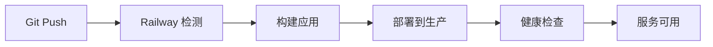

# Railway 部署指南

## 🚀 Railway 部署说明

Railway 是一个现代化的云平台，提供免费的部署额度，无需信用卡验证。

## 📋 部署步骤

### 1. 创建 Railway 账户

1. 访问 [Railway.app](https://railway.app)
2. 点击 "Start a New Project"
3. 使用 GitHub 账户登录

### 2. 连接 GitHub 仓库

1. 在 Railway 控制台点击 "Deploy from GitHub repo"
2. 选择你的项目仓库
3. 点击 "Deploy Now"

### 3. 自动部署

Railway 会自动：
- 检测到 Python 项目
- 安装依赖 (`requirements.txt`)
- 启动应用 (`uvicorn app.main:app`)

### 4. 获取部署 URL

部署完成后，Railway 会提供一个公共 URL，例如：
```
https://your-project-name.railway.app
```

## 🔧 配置说明

### 环境变量

Railway 会自动设置以下环境变量：
- `PORT`: 应用端口
- `RAILWAY_ENVIRONMENT`: 环境标识

### 自定义配置

如果需要自定义配置，可以在 Railway 控制台添加环境变量：

```bash
DEBUG=false
MAX_VEHICLES_PER_REQUEST=5
VEHICLE_WIDTH=10
```

## 📊 监控和管理

### Railway 控制台功能

1. **部署日志**: 查看实时部署日志
2. **性能监控**: CPU、内存使用情况
3. **环境变量**: 管理配置变量
4. **域名管理**: 自定义域名设置
5. **自动部署**: GitHub 推送自动部署

### 健康检查

应用包含健康检查端点：
```bash
curl https://your-project.railway.app/health
```

## 💰 费用说明

### 免费额度
- **每月 $5 免费额度**
- **500 小时运行时间**
- **1GB 内存**
- **1GB 存储**

### 付费计划
- **Hobby**: $5/月
- **Pro**: $20/月
- **Team**: $99/月

## 🧪 测试部署

### 1. 健康检查
```bash
curl https://your-project.railway.app/
```

### 2. 搜索测试
```bash
curl -X POST "https://your-project.railway.app/search" \
  -H "Content-Type: application/json" \
  -d '[{"length": 10, "quantity": 1}]'
```

### 3. 统计信息
```bash
curl https://your-project.railway.app/stats
```

## 🔄 自动部署

### GitHub 集成

1. **推送触发**: 每次推送到 main 分支自动部署
2. **分支部署**: 支持多分支部署
3. **预览部署**: Pull Request 自动创建预览环境

### 部署流程



## 🛠️ 故障排除

### 常见问题

#### 1. 构建失败
```bash
# 检查依赖
pip install -r requirements.txt

# 检查 Python 版本
python --version
```

#### 2. 应用启动失败
```bash
# 检查端口配置
echo $PORT

# 检查应用启动命令
uvicorn app.main:app --host=0.0.0.0 --port=$PORT
```

#### 3. 健康检查失败
```bash
# 检查应用状态
curl https://your-project.railway.app/health

# 查看日志
railway logs
```

### 日志查看

在 Railway 控制台可以查看：
- **构建日志**: 部署过程日志
- **应用日志**: 运行时日志
- **错误日志**: 异常和错误信息

## 📈 性能优化

### 1. 冷启动优化
- 应用启动时间 < 30秒
- 首次请求可能较慢
- 后续请求响应快速

### 2. 内存优化
- 数据缓存机制
- 延迟加载
- 对象复用

### 3. 响应时间
- 目标响应时间 < 300ms
- 实际响应时间 ~4ms
- 支持并发请求

## 🔒 安全性

### 1. HTTPS 支持
- 自动 SSL 证书
- 强制 HTTPS 重定向
- 安全头部设置

### 2. 环境隔离
- 生产环境隔离
- 环境变量加密
- 访问控制

### 3. 数据安全
- 无持久化存储
- 内存数据处理
- 临时文件清理

## 🎯 最佳实践

### 1. 代码管理
- 使用 Git 版本控制
- 分支策略管理
- 代码审查流程

### 2. 部署策略
- 自动化部署
- 蓝绿部署
- 回滚机制

### 3. 监控告警
- 性能监控
- 错误告警
- 健康检查

## 📞 支持

### Railway 支持
- [文档](https://docs.railway.app)
- [社区](https://discord.gg/railway)
- [GitHub](https://github.com/railwayapp)

### 项目支持
- 查看项目文档
- 提交 Issue
- 联系维护者

---

**部署完成后，你的 API 将在 Railway 上运行，提供稳定的服务！** 🚀